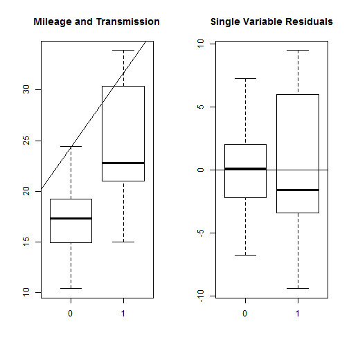
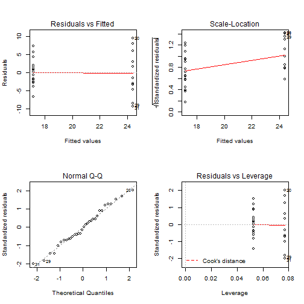
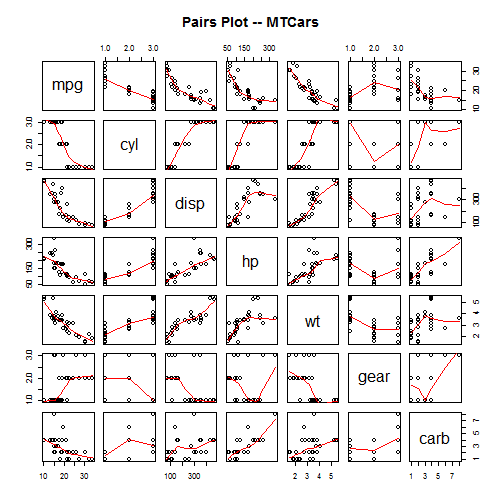
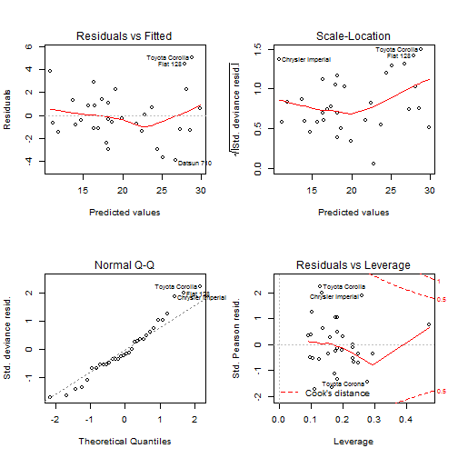

##What impacts the fuel efficiency of a car?

###Regression Models Course Project
* author: Megan Minshew
* date: Tuesday, August 18, 2014

###Executive Summary
Data for this study comes from 1974 Motor Trend US magazine, and comprises fuel consumption and 10 aspects of automobile design and performance for 32 automobiles. This study will assess the impact of various attributes and combinations of attributes on the overall measured vehicle mileage efficiency. The findings of this study are indicators of opportunities to change vehicle components and composition in order to affect fuel efficiency.

###Exploratory Analysis
The data provided contains the following measures and attributes:
1. Miles/(US) gallon
2. Number of cylinders
3. Displacement (cu.in.)
4. Gross horsepower
5. Rear axle ratio
6. Weight (lb/1000)
7. 1/4 mile time
8. V/S
9. Transmission (0 = automatic, 1 = manual)
10. Number of forward gears
11. Number of carburetors

Data is loaded and summarized by candidate attributes. 
Data cleanup and transformation needed is limited to factorizing non-measures.

Attention for this study on type of transmission has been specifically identified as an area of interest. Analysis will highlight this component. 


```r
#using libraries:
library("datasets"); library("MASS")

#load the data and perform a basic survey
data(mtcars)
summary(mtcars)
```

```
##       mpg            cyl            disp             hp       
##  Min.   :10.4   Min.   :4.00   Min.   : 71.1   Min.   : 52.0  
##  1st Qu.:15.4   1st Qu.:4.00   1st Qu.:120.8   1st Qu.: 96.5  
##  Median :19.2   Median :6.00   Median :196.3   Median :123.0  
##  Mean   :20.1   Mean   :6.19   Mean   :230.7   Mean   :146.7  
##  3rd Qu.:22.8   3rd Qu.:8.00   3rd Qu.:326.0   3rd Qu.:180.0  
##  Max.   :33.9   Max.   :8.00   Max.   :472.0   Max.   :335.0  
##       drat            wt            qsec            vs       
##  Min.   :2.76   Min.   :1.51   Min.   :14.5   Min.   :0.000  
##  1st Qu.:3.08   1st Qu.:2.58   1st Qu.:16.9   1st Qu.:0.000  
##  Median :3.69   Median :3.33   Median :17.7   Median :0.000  
##  Mean   :3.60   Mean   :3.22   Mean   :17.8   Mean   :0.438  
##  3rd Qu.:3.92   3rd Qu.:3.61   3rd Qu.:18.9   3rd Qu.:1.000  
##  Max.   :4.93   Max.   :5.42   Max.   :22.9   Max.   :1.000  
##        am             gear           carb     
##  Min.   :0.000   Min.   :3.00   Min.   :1.00  
##  1st Qu.:0.000   1st Qu.:3.00   1st Qu.:2.00  
##  Median :0.000   Median :4.00   Median :2.00  
##  Mean   :0.406   Mean   :3.69   Mean   :2.81  
##  3rd Qu.:1.000   3rd Qu.:4.00   3rd Qu.:4.00  
##  Max.   :1.000   Max.   :5.00   Max.   :8.00
```

```r
nrow(mtcars)
```

```
## [1] 32
```

```r
by(mtcars$mpg, mtcars$am, summary)
```

```
## mtcars$am: 0
##    Min. 1st Qu.  Median    Mean 3rd Qu.    Max. 
##    10.4    15.0    17.3    17.1    19.2    24.4 
## -------------------------------------------------------- 
## mtcars$am: 1
##    Min. 1st Qu.  Median    Mean 3rd Qu.    Max. 
##    15.0    21.0    22.8    24.4    30.4    33.9
```

```r
#factorize the appropriate variables (all non-measures)
mtcars$am <- as.factor(mtcars$am)
mtcars$cyl <- as.factor(mtcars$cyl)
mtcars$gear <- as.factor(mtcars$gear)
```

##Regression Analysis

###Single Variable
To understand the relationship between mileage and transmission type, this study will use single variable regression.


```r
#build the linear model and summarize the coefficients
lm_mpg_am <- lm(mtcars$mpg ~ mtcars$am)
summary(lm_mpg_am)$coefficients
```

```
##             Estimate Std. Error t value  Pr(>|t|)
## (Intercept)   17.147      1.125  15.247 1.134e-15
## mtcars$am1     7.245      1.764   4.106 2.850e-04
```
The model indicates that a vehicle with manual transmission should operate at 7.2 miles per gallon more efficient than a vehicle with automatic transmission. This model is based on a relatively small sampling of data. The t value and residual variation indicate that this model is a poor fit. 

Plots of these findings and subsequent results are available in the appendix. 

###Multiple Variable
The relationship between mileage and all candidate variables will be evaluated through fitting a generalized linear model. 

The glm is fit with the primary variables and dimensions or factors are fed to the model to generate dummy variables. The product of this is evaluated using a stepwise method to consider alternate multi-variate regression models to produce better candidates. 


```r
#Build the glm and fit stepwise
glm_mpg <- glm(mpg ~ am + cyl + gear + disp + hp + drat + wt, data = mtcars)
fit <- stepAIC(glm_mpg, direction = 'both')
```

```
## Start:  AIC=161.9
## mpg ~ am + cyl + gear + disp + hp + drat + wt
## 
##        Df Deviance AIC
## - gear  2      150 158
## - drat  1      148 160
## - disp  1      150 160
## - am    1      151 160
## <none>         148 162
## - cyl   2      175 163
## - hp    1      173 165
## - wt    1      174 165
## 
## Step:  AIC=158.3
## mpg ~ am + cyl + disp + hp + drat + wt
## 
##        Df Deviance AIC
## - drat  1      150 156
## - disp  1      151 156
## - am    1      157 158
## <none>         150 158
## - cyl   2      176 159
## + gear  2      148 162
## - wt    1      182 162
## - hp    1      183 163
## 
## Step:  AIC=156.3
## mpg ~ am + cyl + disp + hp + wt
## 
##        Df Deviance AIC
## - disp  1      151 154
## <none>         150 156
## - am    1      160 156
## - cyl   2      180 158
## + drat  1      150 158
## + gear  2      148 160
## - hp    1      183 161
## - wt    1      183 161
## 
## Step:  AIC=154.5
## mpg ~ am + cyl + hp + wt
## 
##        Df Deviance AIC
## <none>         151 154
## - am    1      161 154
## - cyl   2      180 156
## + disp  1      150 156
## + drat  1      151 156
## + gear  2      150 158
## - hp    1      183 159
## - wt    1      197 161
```

```r
fit$anova
```

```
## Stepwise Model Path 
## Analysis of Deviance Table
## 
## Initial Model:
## mpg ~ am + cyl + gear + disp + hp + drat + wt
## 
## Final Model:
## mpg ~ am + cyl + hp + wt
## 
## 
##     Step Df Deviance Resid. Df Resid. Dev   AIC
## 1                           22      148.4 161.9
## 2 - gear  2   1.6987        24      150.1 158.3
## 3 - drat  1   0.3083        25      150.4 156.3
## 4 - disp  1   0.6168        26      151.0 154.5
```

A model based on transmission type combined with the engine cylinder composition, the horsepower and vehicle weight is indicated as the best model by performing an ANOVA test on the stepwise fit algorithm.

This research proceeds with this model as the best choice and displays the model coefficients and residuals.


```r
#build the final model and summarize
m <- glm(mpg ~ am + cyl + hp + wt, data = mtcars)
summary(m)$coefficients
```

```
##             Estimate Std. Error t value  Pr(>|t|)
## (Intercept) 33.70832    2.60489 12.9404 7.733e-13
## am1          1.80921    1.39630  1.2957 2.065e-01
## cyl6        -3.03134    1.40728 -2.1540 4.068e-02
## cyl8        -2.16368    2.28425 -0.9472 3.523e-01
## hp          -0.03211    0.01369 -2.3450 2.693e-02
## wt          -2.49683    0.88559 -2.8194 9.081e-03
```

```r
summary(m$residuals)
```

```
##    Min. 1st Qu.  Median    Mean 3rd Qu.    Max. 
##  -3.940  -1.260  -0.401   0.000   1.130   5.050
```

###Summary
The results of the model suggest a much lower relationship, with a manual transmission attributable to a 1.8 mile per gallon lift when controlled for key corroborating factors. However, the high p-value of 0.21 for the transmission factor means that there is a relatively low probability that the relationship observed in this data is significant.

More significant factors are found among the engine size, horsepower, and the weight of the car. Also noted is the significant factor that a 6 cylinder engine versus a 4 cylinder engine estimates a reduction of mpg by 3.0 miles per gallon.

Support for the incorporation of additional variables into the model to yield a better prediction is appended as figures at the bottom of the document.

A major factor to explain the statistical signifigance of this study is the high ratio of the total number of available variables (11) to the number of observations (32). 


###Appendix
Figure 1: Single Variable Regression Plot and Residuals

```r
par(mfrow = c(1,2))
plot(mtcars$am, mtcars$mpg, main = 'Mileage and Transmission')
abline(lm_mpg_am)
plot(mtcars$am, resid(lm_mpg_am), main = 'Single Variable Residuals')
abline(h = 0)
```

 

Figure 2: Single Variable Regression - Full Model Fit

```r
layout(matrix(c(1,2,3,4),2,2))
plot(lm_mpg_am)
```

 

Figure 3: Pairs plot for all features and measures

```r
attr <- c('mpg','cyl','disp','hp','wt','gear','carb')
pairs(x = mtcars[,attr], panel = panel.smooth, main = 'Pairs Plot -- MTCars')
```

 

Figure 4: Final Regression Model

```r
layout(matrix(c(1,2,3,4),2,2))
plot(m)
```

 
